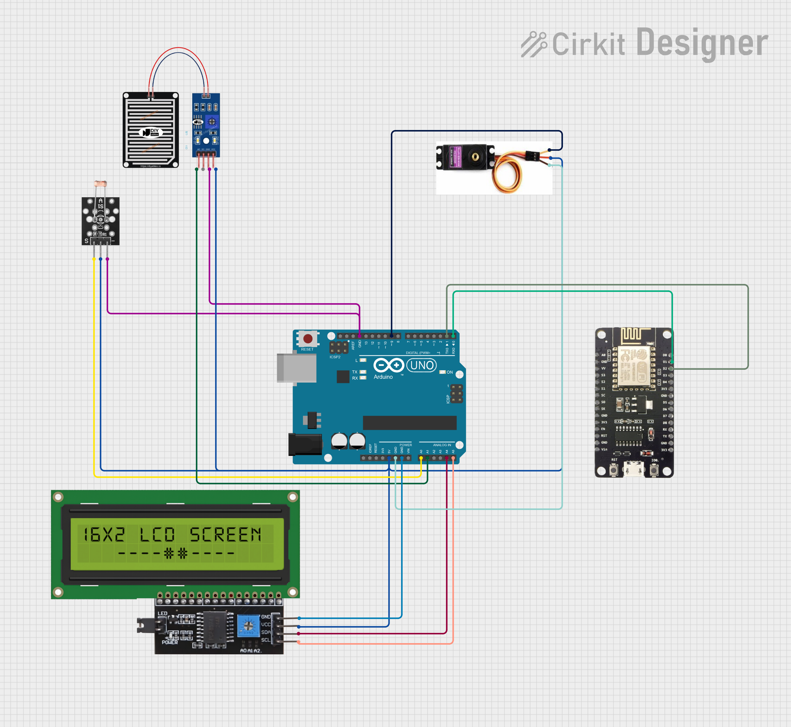

# Automatic Online Clothes Drying System

Arduino and NodeMCU-based automatic clothes drying system with weather prediction capabilities using machine learning.

## Table of Contents
1. [System Introduction](#1-system-introduction)
2. [Required Components](#2-required-components)
3. [Hardware Preparation](#3-hardware-preparation)
4. [Software Installation](#4-software-installation)
5. [Code Upload](#5-code-upload)
6. [System Testing](#6-system-testing)
7. [Machine Learning Integration](#7-machine-learning-integration)
8. [Troubleshooting](#8-troubleshooting)
9. [FAQ](#9-faq)

## 1. System Introduction

This online automatic clothes drying system consists of two main modules:
- **Arduino UNO**: Handles all sensors (LDR and rain sensor) and servo motor
- **NodeMCU ESP8266**: Provides internet connectivity and web interface

These two modules communicate via serial connection, where:
- Arduino sends status and sensor data to NodeMCU
- NodeMCU sends control commands to Arduino based on web input



## 2. Required Components

- Arduino UNO
- NodeMCU ESP8266
- LDR Sensor (Light Dependent Resistor)
- Rain Sensor
- Servo Motor
- LCD I2C 16x2
- Jumper cables as needed
- Power supply for Arduino (5V)
- Power supply for NodeMCU (3.3V/5V)
- 10kΩ resistor (for LDR, if not already installed)

## 3. Hardware Preparation

### Arduino Connections
- LDR connected to pin A0
- Rain sensor connected to pin A1
- Servo motor connected to pin D9
- LCD I2C connected to SDA/SCL pins

### NodeMCU to Arduino Connection
1. Arduino TX → NodeMCU D2 (RX)
2. Arduino RX → NodeMCU D1 (TX)
3. Arduino GND → NodeMCU GND

**Important Notes:**
- Make sure voltage levels match between Arduino (5V) and NodeMCU (3.3V).
- If using a NodeMCU that only accepts 3.3V on input pins, use a voltage divider for the TX Arduino → RX NodeMCU connection.

Simple voltage divider circuit:
```
Arduino TX --[ 2.2kΩ ]--------> NodeMCU RX
                       |
                       |
                    [ 3.3kΩ ]
                       |
                       V
                      GND
```

## 4. Software Installation

### Required Software
1. Arduino IDE
2. The following libraries for Arduino:
   - Wire.h (built-in)
   - LiquidCrystal_I2C.h
   - Servo.h
   
3. The following libraries for NodeMCU:
   - ESP8266WiFi.h
   - ESP8266WebServer.h
   - ArduinoJson.h
   - SoftwareSerial.h

4. Software for Flask:
   - Flask
   - SQLite3
   - Requests
   - Scikit-learn
   - Numpy
   - Joblib

### Library Installation Steps
1. Open Arduino IDE
2. Select **Sketch > Include Library > Manage Libraries...**
3. Search for and install the following libraries:
   - LiquidCrystal I2C by Frank de Brabander
   - ArduinoJson by Benoit Blanchon
   
4. For ESP8266, add the board manager URL:
   - Open **File > Preferences**
   - In "Additional Boards Manager URLs" add: `http://arduino.esp8266.com/stable/package_esp8266com_index.json`
   - Select **Tools > Board > Boards Manager...**
   - Search for "ESP8266" and install the latest version

5. For Flask and Python libraries, run:
   ```
   pip install flask requests scikit-learn numpy joblib
   ```

## 5. Code Upload

### Arduino Code Upload Steps
1. Connect Arduino to computer via USB
2. Open the prepared Arduino code
3. Select "Arduino UNO" board in **Tools > Board**
4. Select the appropriate port in **Tools > Port**
5. Click "Upload"

### NodeMCU Code Upload Steps
1. Disconnect Arduino from computer
2. Connect NodeMCU to computer via USB
3. Open the prepared NodeMCU code
4. Edit WiFi configuration (SSID and password)
5. Select "NodeMCU 1.0 (ESP-12E Module)" board in **Tools > Board**
6. Select the appropriate port in **Tools > Port**
7. Click "Upload"

## 6. System Testing

### Testing Steps
1. Connect both modules according to the diagram (Arduino TX → NodeMCU D2, Arduino RX → NodeMCU D1, GND → GND)
2. Connect power to Arduino and NodeMCU
3. Wait until NodeMCU connects to WiFi (check Serial Monitor)
4. Note the IP address displayed in the Serial Monitor
5. Open a browser on your laptop/phone and access that IP address
6. You will see the automatic clothes drying system control page

### Functionality Testing
1. **Sensor Reading Test**
   - Monitor LDR and rain sensor values on the web page
   - Compare with values on Arduino LCD
   
2. **Manual Control Test**
   - Click "Open Drying Rack" button and check if the servo moves
   - Click "Close Drying Rack" button and check if the servo moves
   
3. **Automatic Test**
   - Cover the LDR sensor to simulate dark conditions
   - Wet the rain sensor to simulate rain conditions
   - Observe if the drying rack moves automatically

## 7. Machine Learning Integration

This system uses a Decision Tree Classifier model to predict weather conditions based on collected sensor data. The ML implementation is on the server side (Flask application) which receives data from NodeMCU.

### ML Model Architecture
- **Model**: Decision Tree Classifier with optimized parameters to avoid overfitting
- **Input Features**: Time series data from LDR and rain sensors
- **Output**: Weather prediction (rain/no rain) with confidence level

### Data Processing
1. **Data Collection**:
   - Data from sensors (LDR and rain) collected every 3 seconds
   - Data stored in SQLite database (sensor_data.db)

2. **Data Preprocessing**:
   - Data scaled using MinMaxScaler (range 0-1)
   - Data formatted as time series with window size 3
   - Target converted to categorical (1 = rain, 0 = no rain)

3. **Model Training**:
   - Data split into training (80%) and testing (20%)
   - Model trained with optimized parameters:
     ```python
     DecisionTreeClassifier(
         max_depth=3,
         min_samples_split=5,
         min_samples_leaf=3,
         class_weight='balanced'
     )
     ```
   - Model saved using Joblib

4. **Prediction**:
   - Model uses latest data (window size - 1) to predict weather
   - Prediction results include probability of rain (0-1)

### Machine Learning Features
1. **Auto Training**:
   - System automatically retrains the model every 30 minutes
   - Training only performed if sufficient data is available

2. **Weather Prediction API**:
   - `/predict-weather` endpoint provides weather predictions
   - Response contains prediction status (will rain/won't rain) and probability

3. **Integration with Auto Mode**:
   - Weather predictions can be used for automatic decision making
   - System will automatically close the drying rack if potential rain is detected

### How to Train the Model Manually
1. Open the settings page from the web interface
2. Click the "Train Model" button
3. Wait until the training process is complete
4. Model accuracy will be displayed after training is finished

### How to View Weather Predictions
1. Open the dashboard or realtime monitoring page
2. Check the "Weather Prediction" panel
3. The system will display weather predictions along with confidence level

## 8. Troubleshooting

### Serial Connection Issues
- **Arduino and NodeMCU not communicating**
  - Recheck cable connections (TX → RX, RX → TX)
  - Ensure voltage levels are appropriate (use voltage divider if necessary)
  - Try swapping RX/TX pins if communication still fails

### WiFi Issues
- **NodeMCU not connecting to WiFi**
  - Check SSID and password
  - Make sure router is within range
  - Try restarting NodeMCU

### Servo Issues
- **Servo not moving**
  - Check servo connection to Arduino
  - Ensure Arduino power supply is sufficient to run the servo
  - Try testing the servo with a simple code to ensure it works

### Web Interface Issues
- **Cannot access web interface**
  - Make sure your device is on the same WiFi network
  - Try accessing the IP with a different browser
  - Check for firewalls that might be blocking the connection

### Machine Learning Issues
- **Error when Training Model**
  - Ensure sufficient data is available (minimum 13 data points for window size 3)
  - Check data format in the database
  - Make sure scikit-learn and numpy libraries are installed

- **Inaccurate Predictions**
  - Collect more data for training
  - Try adjusting model parameters (max_depth, min_samples_split)
  - Check if sensor values are properly calibrated

## 9. FAQ

### Q: Does the system still work if internet is down?
A: Yes, automatic control by Arduino still functions even if NodeMCU loses internet connection. However, remote access via web will not function until internet connection is restored.

### Q: How long can the system operate?
A: As long as power supply is available, the system can operate without time limits. No connection to a laptop is needed after initial setup.

### Q: Can I add other sensors?
A: Yes, you can add other sensors to Arduino, then configure them to send additional data through serial communication to NodeMCU.

### Q: How do I change sensor thresholds?
A: Change the `LDR_THRESHOLD` and `RAIN_THRESHOLD` values in the settings page of the web interface or directly in the Arduino code.

### Q: Can I access the system from outside my home network?
A: Yes, but it requires additional configuration such as port forwarding on your router or using services like MQTT/IoT platforms.

### Q: How accurate is the weather prediction?
A: Prediction accuracy depends on the amount and quality of collected data. With sufficient data, the system can achieve accuracy above 70%.

### Q: How long does it take to train the model?
A: The model training process typically takes 1-2 seconds depending on the amount of available data.

### Q: What happens if the weather prediction is wrong?
A: The system has a manual mode that allows users to control the drying rack directly if automatic predictions are not accurate.
